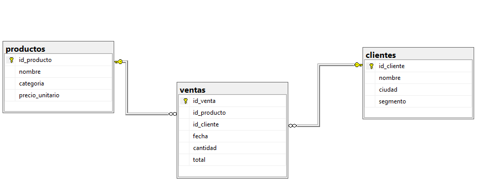

# 🧠 Fundamentos de SQL – Proyecto de Práctica

📁 Carpeta: `Fundamentos SQL`
📅 Fecha: Julio 2025
👨‍💻 Autor: Héctor Alejandro

---

## 📘 AJUSTE FINAL DEL CRONOGRAMA – 7 DÍAS TOTALES

| Día | Temas principales                                    |
| --- | ---------------------------------------------------- |
| 1   | SELECT, FROM, WHERE, LIKE, IN                        |
| 2   | ORDER BY, AS, TOP                                    |
| 3   | JOIN, AND, OR, CASE                                  |
| 4   | IS NULL, INSERT, UPDATE, DELETE                      |
| 5   | GROUP BY, HAVING, funciones (COUNT, SUM, AVG)        |
| 6   | MIN, MAX, CREATE, ALTER TABLE, DROP                  |
| 7   | COMMIT, ROLLBACK y tips finales para entrevistas SQL |

---

## 🧪 Día 1 – Consultas Básicas

```sql
-- Mostrar todos los clientes
SELECT * FROM clientes;

-- Mostrar solo nombre y ciudad de los clientes
SELECT nombre, ciudad FROM clientes;

-- Clientes cuyo nombre comienza por 'Tienda'
SELECT * FROM clientes WHERE nombre LIKE 'Tienda%';

-- Mostrar todos los productos
SELECT * FROM productos;

-- Productos que sean de la categoría Granos o Aceites
SELECT * FROM productos WHERE categoria IN('Granos','Aceites');

-- Productos cuyo precio sea mayor a 5000
SELECT nombre, precio_unitario FROM productos WHERE precio_unitario > 5000;
```

## 🧪 Día 2 – Ordenamientos y Alias

```sql
-- Productos ordenados por precio (mayor a menor)
SELECT * FROM productos ORDER BY precio_unitario DESC;

-- Clientes ordenados por ciudad (A-Z)
SELECT * FROM clientes ORDER BY ciudad ASC;

-- Mostrar los 3 productos más baratos
SELECT TOP 3 * FROM productos ORDER BY precio_unitario ASC;

-- Alias personalizado en columnas
SELECT nombre AS cliente, ciudad AS ubicacion FROM clientes;

-- Ventas ordenadas por total (de mayor a menor)
SELECT * FROM ventas ORDER BY total DESC;
```

## 🧪 Día 3 – JOIN, AND, OR, CASE

```sql
-- Mostrar las ventas junto con nombre del cliente y nombre del producto
SELECT v.id_venta, c.nombre AS cliente, p.nombre AS producto, v.fecha, v.total
FROM ventas v
JOIN clientes c ON v.id_cliente = c.id_cliente
JOIN productos p ON v.id_producto = p.id_producto;

-- Clientes de Bogotá y segmento Corporativo
SELECT * FROM clientes WHERE ciudad = 'Bogotá' AND segmento='Corporativo';

-- Productos que sean Granos o con precio >8000
SELECT * FROM productos WHERE categoria='Granos' OR precio_unitario>8000;

-- Clasificar productos por precio
SELECT nombre,
  CASE
    WHEN precio_unitario >= 8000 THEN 'Alta'
    WHEN precio_unitario >= 3000 THEN 'Medio'
    ELSE 'Baja'
  END AS rango_precio
FROM productos;

-- Clasificar ventas por monto
SELECT id_venta, total,
  CASE
    WHEN total >= 20000 THEN 'Venta Alta'
    WHEN total >= 10000 THEN 'Venta Media'
    ELSE 'Venta Baja'
  END AS Clasificacion_venta
FROM ventas;
```

## 🧪 Día 4 – Inserción, Actualización y Eliminación

```sql
-- Buscar clientes sin ciudad (IS NULL)
SELECT * FROM clientes WHERE ciudad IS NULL;

-- Insertar nuevo cliente de prueba
INSERT INTO clientes (nombre, ciudad, segmento) VALUES('Cliente Demo', NULL, 'Retail');

-- Verificar que se insertó
SELECT * FROM clientes WHERE id_cliente=12;

-- Actualizar la ciudad del cliente 12
UPDATE clientes SET ciudad='Cartagena' WHERE id_cliente=12;

-- Eliminar el cliente 12
DELETE FROM clientes WHERE id_cliente=12;
```

## 🧪 Día 5 – Funciones y Agrupaciones

```sql
-- Total de ventas por producto
SELECT p.nombre AS producto, SUM(v.total) AS total_ventas
FROM ventas v
JOIN productos p ON v.id_producto = p.id_producto
GROUP BY p.nombre;

-- Promedio del total de ventas por cliente
SELECT c.nombre AS cliente, AVG(v.total) AS promedio_venta
FROM ventas v
JOIN clientes c ON v.id_cliente = c.id_cliente
GROUP BY c.nombre;

-- Conteo de ventas por ciudad
SELECT c.ciudad, COUNT(v.id_venta) AS cantidad_ventas
FROM ventas v
JOIN clientes c ON v.id_cliente = c.id_cliente
GROUP BY c.ciudad;

-- Productos con más de 2 ventas (uso de HAVING)
SELECT p.nombre AS producto, COUNT(v.id_venta) AS veces_vendido
FROM ventas v
JOIN productos p ON v.id_producto = p.id_producto
GROUP BY p.nombre
HAVING COUNT(v.id_venta) >= 2;

-- Precio mínimo y máximo por categoría de producto
SELECT categoria, MIN(precio_unitario) AS precio_minimo, MAX(precio_unitario) AS precio_maximo
FROM productos
GROUP BY categoria;
```

## 🧪 Día 6 – DDL y restauración de datos

```sql
-- Crear tabla auxiliar de prueba
CREATE TABLE proveedores (
  id_proveedor INT PRIMARY KEY,
  nombre VARCHAR(100),
  ciudad VARCHAR(50)
);

-- Agregar columna a productos
ALTER TABLE productos ADD stock INT;

-- Eliminar columna stock
ALTER TABLE productos DROP COLUMN stock;

-- Eliminar tabla de prueba proveedores
DROP TABLE proveedores;

-- Crear copia de seguridad
SELECT * INTO ventas_backup FROM ventas;

-- Truncar tabla
TRUNCATE TABLE ventas;

-- Restaurar datos
SET IDENTITY_INSERT ventas ON;
INSERT INTO ventas (id_venta, id_cliente, id_producto, fecha, cantidad, total)
SELECT id_venta, id_cliente, id_producto, fecha, cantidad, total FROM ventas_backup;
SET IDENTITY_INSERT ventas OFF;

-- Eliminar backup
DROP TABLE ventas_backup;
```

## 🧪 Día 7 – Transacciones y Subconsultas

```sql
-- Insertar y confirmar (COMMIT)
BEGIN TRANSACTION;
INSERT INTO clientes (nombre, ciudad, segmento)
VALUES ('Cliente Transacción', 'Cali', 'Corporativo');
COMMIT;

-- Insertar y deshacer (ROLLBACK)
BEGIN TRANSACTION;
INSERT INTO clientes (nombre, ciudad, segmento)
VALUES ('Cliente Error', 'Bogotá', 'Retail');
ROLLBACK;

-- Producto más caro
SELECT * FROM productos WHERE precio_unitario = (
  SELECT MAX(precio_unitario) FROM productos
);

-- Clientes con ventas superiores al promedio
SELECT c.nombre, v.total
FROM ventas v
JOIN clientes c ON v.id_cliente = c.id_cliente
WHERE v.total > (
  SELECT AVG(total) FROM ventas
);

-- Productos vendidos más de una vez
SELECT * FROM productos WHERE id_producto IN (
  SELECT id_producto FROM ventas GROUP BY id_producto HAVING COUNT(*) > 1
);

-- Clientes sin ventas registradas
SELECT * FROM clientes WHERE id_cliente NOT IN (
  SELECT id_cliente FROM ventas
);

-- Promedio y máximo de ventas
SELECT AVG(total) AS promedio_total, MAX(total) AS venta_mayor FROM ventas;
```

## 🗃️ Respaldo de la base de datos (.BAK y .sql)

* Se generó respaldo con extensión `.bak` desde SQL Server Management Studio (`ventas_sqlserver_bi.bak`).
* También se generó script `.sql` de toda la base (`ventas_sqlserver_bi_backup.sql`) que puede ejecutarse para restaurar la estructura y datos completos.
* Ambos archivos están almacenados en la carpeta `Fundamentos SQL` para fines de seguridad, restauración o despliegue.

---

## 🧠 Tips SQL para entrevistas y práctica

* Siempre revisar las claves primarias y foráneas antes de hacer JOIN
* Usar `IS NULL` en lugar de `= NULL`
* Probar las transacciones con `ROLLBACK` en desarrollo
* Identificar cuándo una subconsulta es más clara que un JOIN
* Usar alias (`AS`) para mejorar la legibilidad

---
---

## 🧮 Diagrama Entidad-Relación

Este diagrama representa la estructura lógica de la base de datos usada en las prácticas:

- **productos**: catálogo de productos.
- **clientes**: información básica del cliente.
- **ventas**: tabla de hechos con relaciones a productos y clientes.



¡Proyecto 100% funcional y validado en SQL Server Management Studio! 🚀
